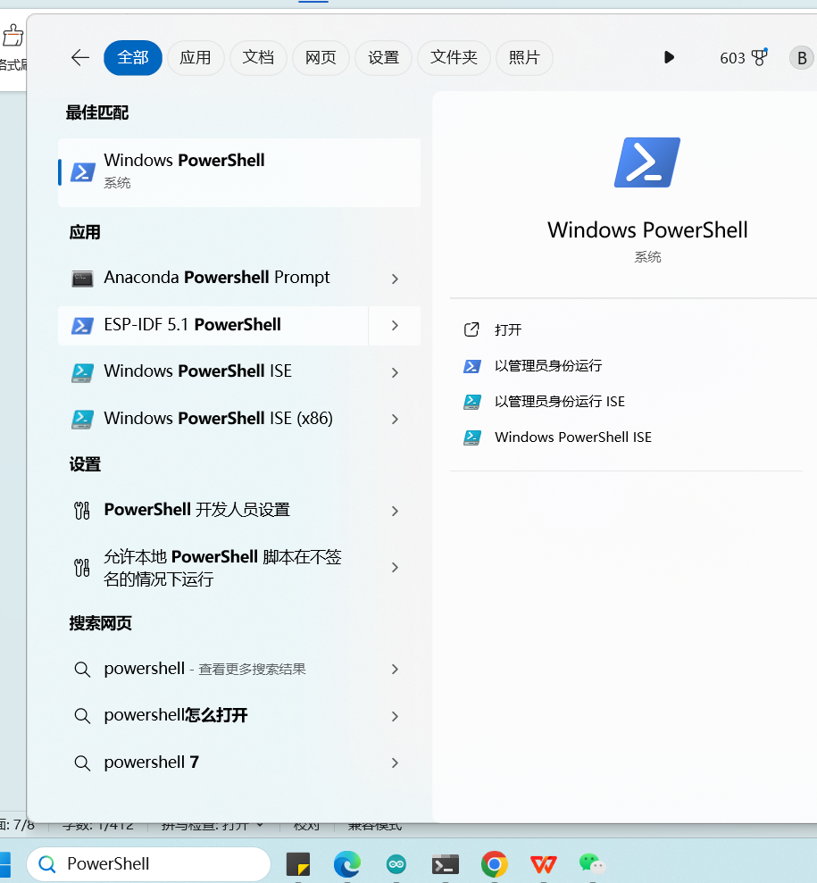

# 环境配置
[English Version](/doc/edgeimpulseConfigTutorial.md)
## 注册EdgeImpulse账号
https://edgeimpulse.com/

## 安装edge impulse cli
- 安装 [Python 3](https://www.python.org/) 

- 安装 [Node.js v14 or higher](https://nodejs.org/en/)
如果之前安装过，PowerShell 命令行输入node -v查看版本。

- 以管理员身份打开PowerShell


- 安装edge impulse cli工具，PowerShell 命令行输入
```bash
npm install -g edge-impulse-cli --force
```

## FAQ
**Q:提示缺失C:\Users\DFRobot\AppData\Roaming\npm\node_modules\edge-impulse-cli\build\cli\daemon.js？**
A：查找daemon.js文件，然后更改daemon.js文件位置，粘贴到这个路径。

**Q: 报错+CategoryInfo : SecurityError: (:) []，ParentContainsErrorRecordException +FullyQualifiedErrorId : UnauthorizedAccess？**
A：以管理员身份打开PowerShell 输入
```bash
set-executionpolicy remotesigned
```
