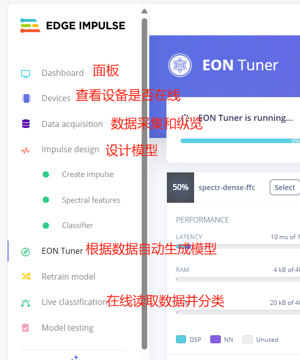
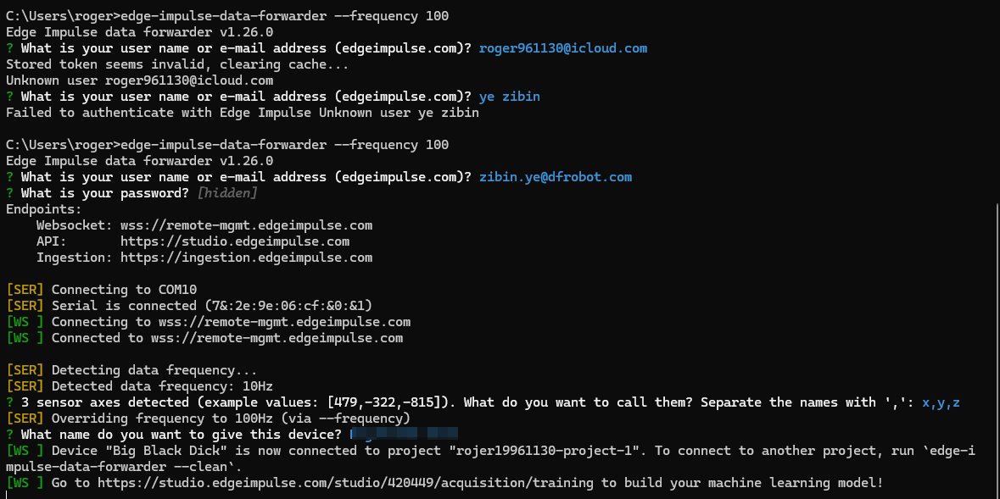
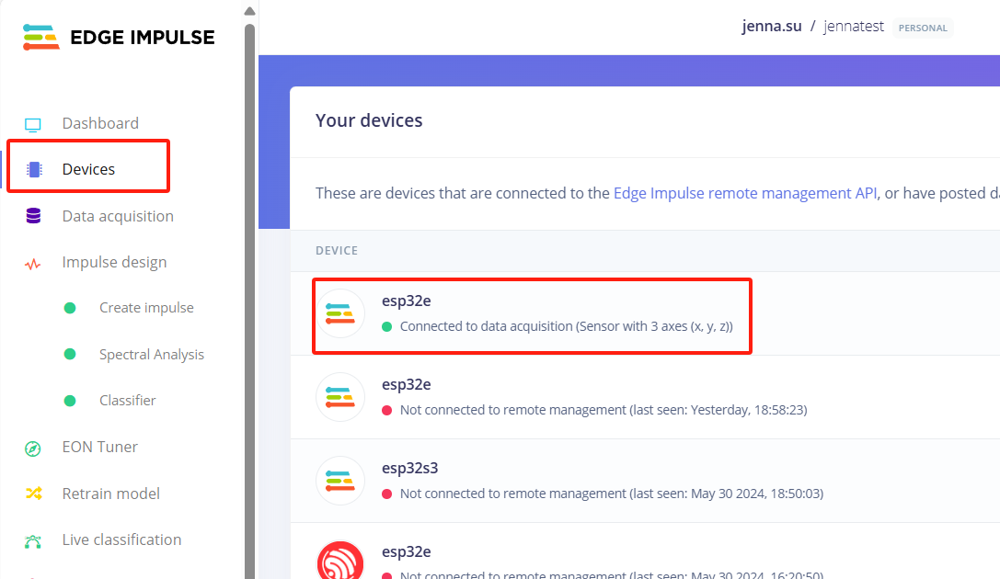
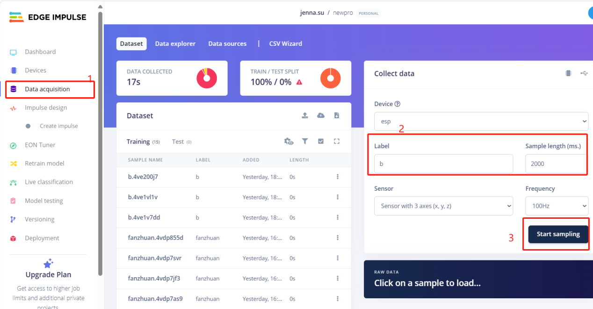
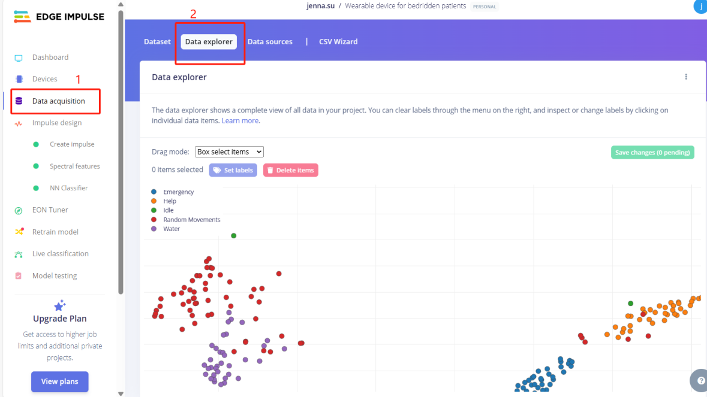
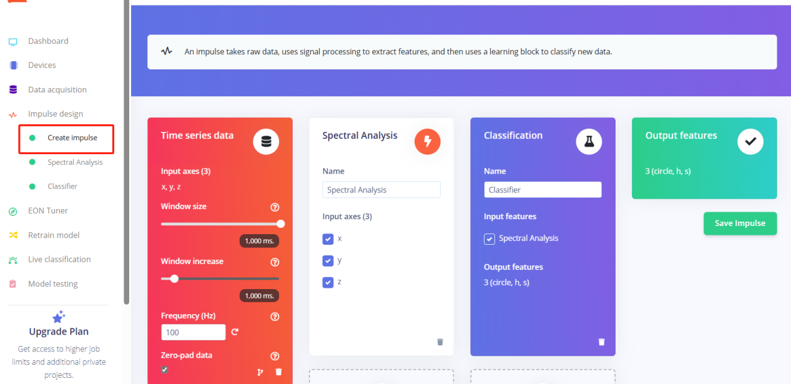
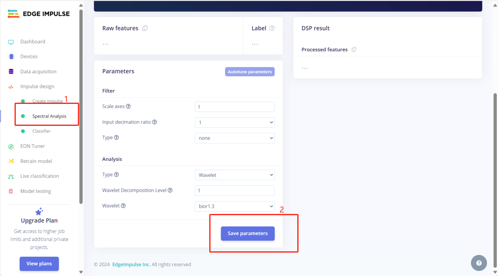
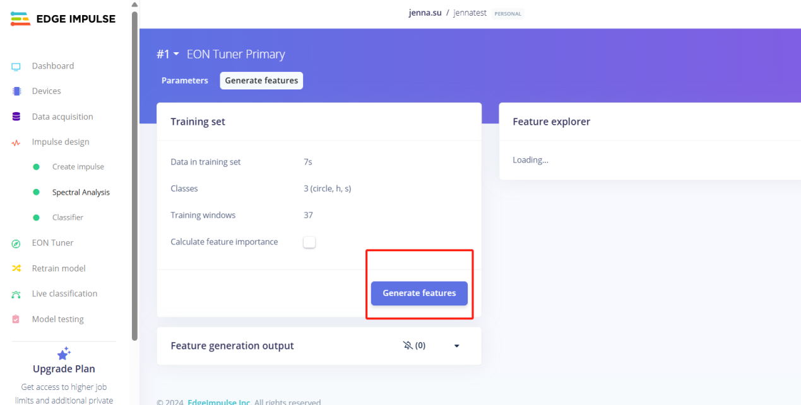
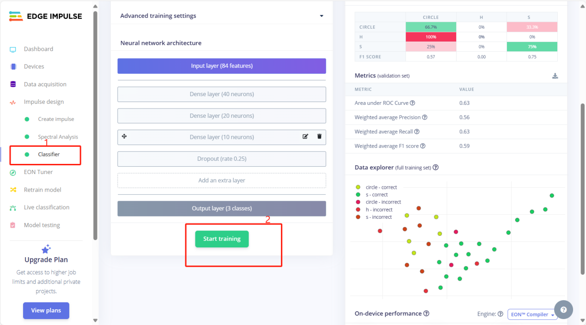
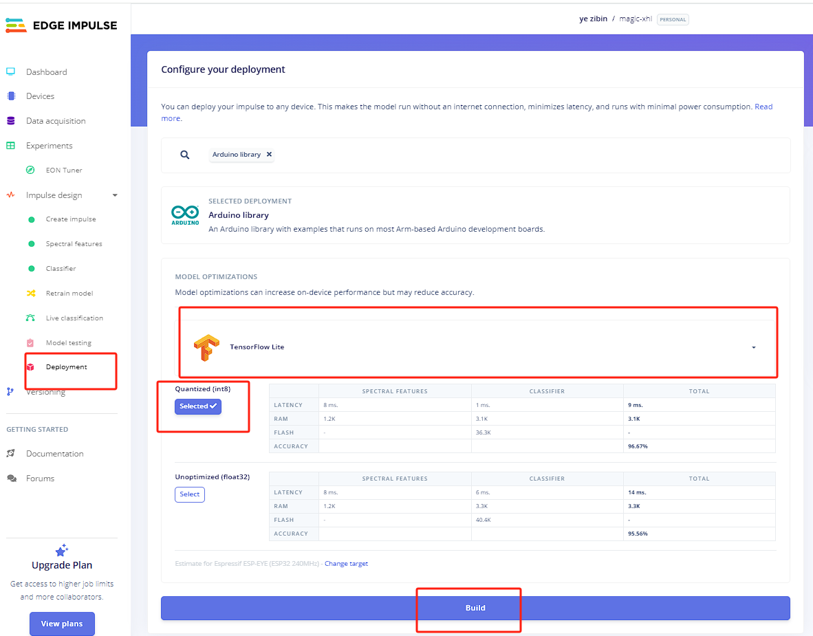

# Magic Wand Model Training Tutorial
Visit the EdgeImpulse website and log in.
You can either fork an existing EdgeImpulse project for modification or create a new project.

EdgeImpulse: https://edgeimpulse.com/<br/>
Project Link: https://studio.edgeimpulse.com/studio/587543<br/>

# Web Panel Overview


# Training Process
## Flash Training Code
Visit the [training code project](../src/ModelTrain/) and flash it.

## Data Forwarding
Open PowerShell and enter the following command to forward serial data to EdgeImpulse:
```bash
edge-impulse-data-forwarder --frequency 100
```
Follow the prompts to enter your EdgeImpulse platform account and password. Label the serial data as x, y, z, and name the device as esp32 to connect the K10 to the platform.



## Sampling
Select the data acquisition section, fill in the label for motion sensor data, set the sampling duration to 2000ms, and start sampling.


## View Data Distribution
Select "View Data Distribution" and make targeted modifications to the data.


## Define Network Structure
Customize the network structure and save it.


## Generate Features
Generate feature values.



## Train Model


## Export Model

